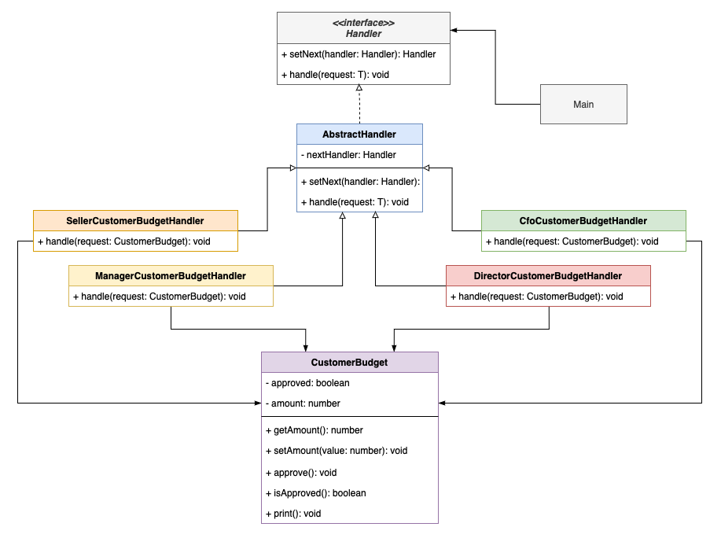

# Customer Budget Approval
## A Chain of Responsibility implementation

Project made to show a concrete example of the Chain of Responsibility design pattern
during a presentation to UFPR's Software Development Practice class of Nov 2021.

The program gets a customer budget as an input and uses the CoR to decide which company
collaborator will approve the budget.

- Seller: approves budgets bellow $ 1.000,00;
- Manager: approves budgets bellow $ 5.000,00;
- Director: approves budgets bellow $ 10.000,00;
- CFO: approves budgets above $ 10.000,00.

### Compilation
```
$ make
```
### Running
```
$ ./customer-budget {budget}
```
Where `{budget}` is an arbitrary number representing the total amount of the Customer Budget to be approved.

### Architecture

